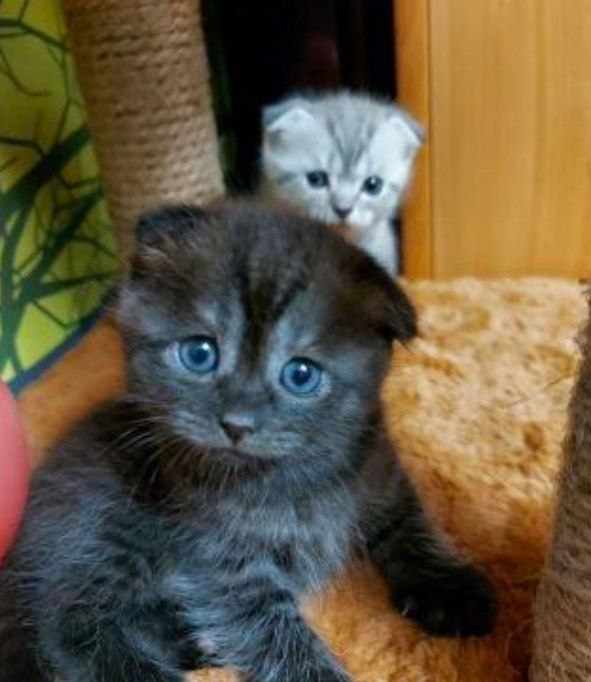

# **Я люблю котиков!**
## И помимо котиков я также люблю учиться. 

Большое количество времени я уделяю своей учебе и образованию, особенно в этом году. 

Сначала  я думала, что беру сверх того, что могла бы сделать 
>Я ученик 10 класса, параллельно студент курса, большое количество времени у меня отнимает школа, подготовка к экзаменам и внеурочная деятельность.

Но несмотря на большую загруженность я нахожу время всему, и самое главное - себе и своей личной жизни.
#### Я - очень активный и коммуникабельный человек.  А вжизни меня окружают невероятные люди, которые имеют мечты и не просто говрят про них,  а действительно достигают их. 

**Такие слова про меня говорят мои друзья:**
> Дарина, просто прекрасный бро. Дарина, по себе очень приятный и гиперактивный человек, с которым соскучиться просто невозможно. Все моменты помню (большую часть), словно пережила вчера их все. Дарина умеет разбавить самую скучную обстановку, своими шутками, смехом и различными выкидонами. Помню играли в разные игры. Воистину искренний человек, который, не перебивая, даёт высказаться, и поможет поддержкой и советом. Я ровняюсь на нее, она мой пример. Дарина, ты очень классная бро, спасибо,что ты есть!

**И я искренне рада, что люди так могут отозвваться обо мне.**

